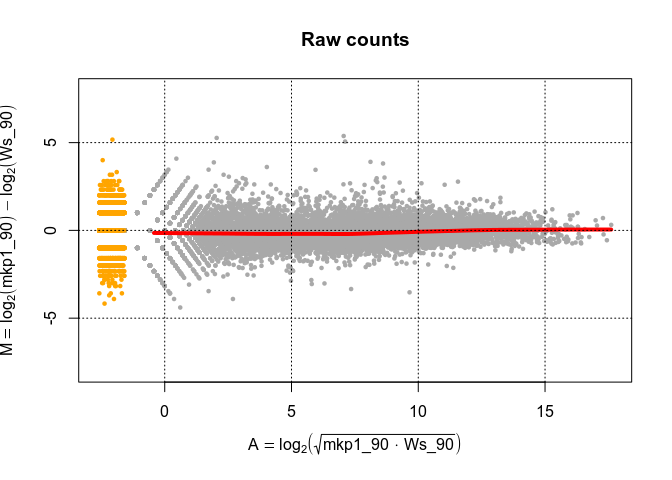
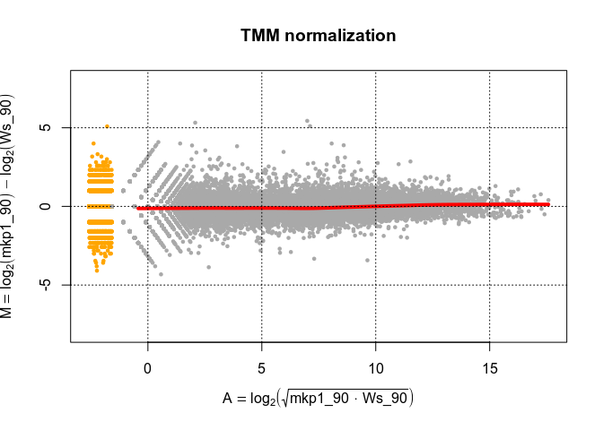
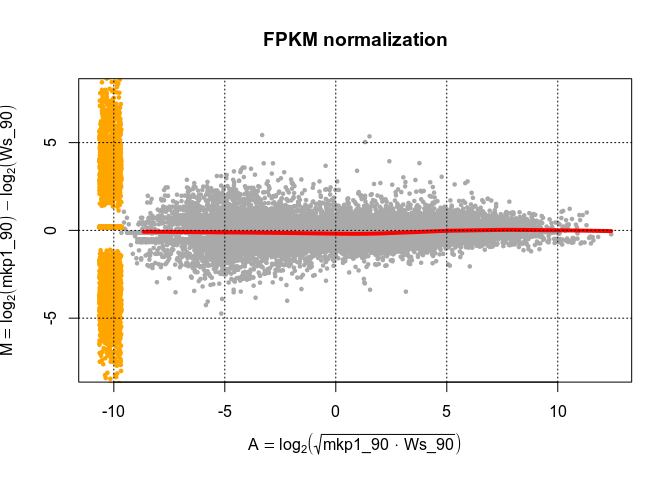
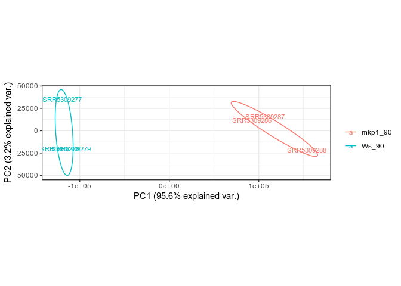

RNA-seq pipeline
================

Bioinformatics pipeline to perform a basic RNA-seq analysis, from getting the FASTQ files, to Differential Gene Expression and Gene Ontology Enrichment Analysis.

It explains the steps of the analysis and provides Perl, bash and R scripts (`script` folder) to run the analysis automatically with a few commands in the [last section](https://github.com/alfonsosaera/RNAseq#automate-the-analysis).

Dataset
=======

I will use part of the dataset published in by [Jiang et al. Journal of Experimental Botany 2017, 68: 5207–5220](https://academic.oup.com/jxb/article/68/18/5207/4540950)


They perform a transcriptome analysis in Arabidopsis wild type, mkp1 and mkp1 mpk6 seedlings treated with the bacterially derived PAMP elf26 for 0, 30, and 90 min. The raw Illumina reads generated from RNAseq experiments were deposited at NCBI (SRP101277).

I will use the wild type and mkp1 seedlings at 90 min.

<table style="width:94%;">
<colgroup>
<col width="15%" />
<col width="15%" />
<col width="15%" />
<col width="15%" />
<col width="15%" />
<col width="18%" />
</colgroup>
<thead>
<tr class="header">
<th>BioSample</th>
<th>Experiment</th>
<th>SRA_Sample</th>
<th>Run</th>
<th>Exp_Name</th>
<th align="center">replicate</th>
</tr>
</thead>
<tbody>
<tr class="odd">
<td>SAMN06461658</td>
<td>SRX2609596</td>
<td>SRS2014400</td>
<td>SRR5309288</td>
<td>Ws_90_rep1</td>
<td align="center">Biological_replicate_1</td>
</tr>
<tr class="even">
<td>SAMN06461659</td>
<td>SRX2609595</td>
<td>SRS2014399</td>
<td>SRR5309287</td>
<td>Ws_90_rep2</td>
<td align="center">Biological_replicate_2</td>
</tr>
<tr class="odd">
<td>SAMN06461660</td>
<td>SRX2609594</td>
<td>SRS2014398</td>
<td>SRR5309286</td>
<td>Ws_90_rep3</td>
<td align="center">Biological_replicate_3</td>
</tr>
<tr class="even">
<td>SAMN06461667</td>
<td>SRX2609587</td>
<td>SRS2014391</td>
<td>SRR5309279</td>
<td>mkp1_90_rep1</td>
<td align="center">Biological_replicate_1</td>
</tr>
<tr class="odd">
<td>SAMN06461668</td>
<td>SRX2609586</td>
<td>SRS2014390</td>
<td>SRR5309278</td>
<td>mkp1_90_rep2</td>
<td align="center">Biological_replicate_2</td>
</tr>
<tr class="even">
<td>SAMN06461669</td>
<td>SRX2609585</td>
<td>SRS2014389</td>
<td>SRR5309277</td>
<td>mkp1_90_rep3</td>
<td align="center">Biological_replicate_3</td>
</tr>
</tbody>
</table>

The sample information of all datasets, or just the selected ones, can be downloaded from the [NCBI SRA Run Selector](https://www.ncbi.nlm.nih.gov/Traces/study/?acc=SRP101277) by clicking `RunInfo Table`. 

Raw data download
=================

To download the FASTQ files, we need the RUN number of each sample and `fastq-dump`, or its faster version `fasterq-dump`, from the [`SRA Toolkit`](https://www.ncbi.nlm.nih.gov/sra/docs/toolkitsoft/).

We can manually download each one as below

``` shell
fasterq-dump SRR5309277
fasterq-dump SRR5309278
...
fasterq-dump SRR5309287
fasterq-dump SRR5309288
```

or use the `fastq-dump_SRRlist.sh` script

``` shell
#! /bin/bash

# Modify SRA_toolkit_path as needed
files=`cat SRR_Acc_List.txt`
SRA_toolkit_path="/mnt/518D6BCF3ECC578E/sratoolkit.current-ubuntu64/sratoolkit.2.9.2-ubuntu64/bin"

for i in $files
  do
    # $SRA_toolkit_path/fastq-dump --split-3 --gzip --accession $i
    $SRA_toolkit_path/fasterq-dump $i
  done
```

that will read the RUN codes from the `SRR_Acc_List.txt` file that can be also downloaded from the [NCBI SRA Run Selector](https://www.ncbi.nlm.nih.gov/Traces/study/?acc=SRP101277) by clicking `AccessionList`.

``` shell
SRR5309277
SRR5309278
...
SRR5309288
```

Just move the script (make it executable with `chmod`) and the `SRR_Acc_List.txt` file to the desired folder (e.g. fastq) and execute it as shown below.

``` shell
./fastq-dump_SRRlist.sh
```

Alternatively this can also be done directly from the terminal

``` shell
cat SRR_Acc_List.txt | while read id; do fasterq-dump $id; done
```

Read preprocessing
==================

This step performs adapter and quality trimming. Quality evaulation is done with [`fastqc`](https://www.bioinformatics.babraham.ac.uk/projects/download.html) and [`bbuk`](https://jgi.doe.gov/data-and-tools/bbtools/bb-tools-user-guide/installation-guide/) for the trimming.

fastqc can be run with the following code

``` shell
fastqc SRR5309277.fastq
```


and `bbduk` as follows

``` shell
bbduk.sh in=SRR5309277.fastq out=SRR5309277.trim.fastq minlen=25 qtrim=r trimq=10
```

with the settings minimum size 25 bp and minimum quality score 10. Then, the quality of the resulting FASTQ file can be checked again.

``` shell
fastqc SRR5309277.trim.fastq
```

 The `preprocessing_SE.pl` script performs all these steps automatically for all FASTQ files.

``` shell
./preprocessing_SE.pl
```

Initial quality analysis reports are saved in the `results/fastqc` folder. Trimmed FASTQ files are saved in the `results/tr_fastq` folder and the final quality reports in the `results/tr_fastq/fastqc` folder.

Reads alignment and counting
============================

The [Spliced Transcripts Alignment to a Reference](https://github.com/alexdobin/STAR) (`STAR`) software was used to align the reads to the genome. `STAR` is an ultrafast universal RNA-seq aligner based on a previously undescribed RNA-seq alignment algorithm that uses sequential maximum mappable seed search in uncompressed suffix arrays followed by seed clustering and stitching procedure ([Dobin et al. 2013](https://www.ncbi.nlm.nih.gov/pubmed/23104886)).

The `STAR` workflow consists of 2 steps:

1.  Generating genome indexes files. In this step we must provide the reference genome sequence (FASTA file) and annotations (GTF file), from which `STAR` generates genome indexes used in the 2nd (mapping) step. The indexes are saved to disk and need only be generated once.
2.  Mapping reads to the genome. In this step user supplies the index files (1st step) and the RNA-seq reads (sequences) as FASTA or FASTQ files.

STAR index
==========

Although a collection of STAR genomes is available from <http://labshare.cshl.edu/shares/gingeraslab/www-data/dobin/STAR/STARgenomes/>, it is highly recommended to generate our own genome index with updated assemblies (FASTA file) and annotations (GTF file) as shown below

``` shell
STAR --runThreadN 4 \
     --runMode genomeGenerate --genomeDir $indexPATH \
     --genomeFastaFiles $fastaPATH/genome.fa \
     --sjdbGTFfile $GTFpath/genes.gtf
```

Mapping and counting
====================

Mapping of the reads (trimmed FASTQ file) with `STAR`

``` shell
STAR --runThreadN 4 \  
     --genomeDir $indexPATH \
     --readFilesIn SRR5309277.trim.fastq \
     --outSAMtype BAM SortedByCoordinate
```

The output, a sorted by coordinateBAM file similar to `samtools sort` command, is named Aligned.sortedByCoord.out.bam. Reads are assigned to genes with [`featureCounts`](http://bioinf.wehi.edu.au/featureCounts/) from the [Subread package](http://subread.sourceforge.net/)

``` shell
featureCounts -T 4 \
              -a $GTFpath/genes.gtf \
              -o gene_assigned_P \
              Aligned.sortedByCoord.out.bam
```

The `mapping_counting_SE.sh` script performs all these steps automatically for all trimmed FASTQ files.

``` shell
./mapping_counting_SE.sh
```

Matrices of counts are saved in the `results/STAR_alignment` folder. The terminal output for one sample is shown below.

    13:10:56 - Processing sample SRR5309277
    13:10:56 - STAR MAPPING
    Dec 04 13:10:56 ..... started STAR run
    Dec 04 13:10:56 ..... loading genome
    Dec 04 13:11:29 ..... started mapping
    Dec 04 13:14:58 ..... started sorting BAM
    Dec 04 13:16:11 ..... finished successfully
    13:16:12 - FeatureCounts

            ==========     _____ _    _ ____  _____  ______          _____
            =====         / ____| |  | |  _ \|  __ \|  ____|   /\   |  __ \
              =====      | (___ | |  | | |_) | |__) | |__     /  \  | |  | |
                ====      \___ \| |  | |  _ <|  _  /|  __|   / /\ \ | |  | |
                  ====    ____) | |__| | |_) | | \ \| |____ / ____ \| |__| |
            ==========   |_____/ \____/|____/|_|  \_\______/_/    \_\_____/
          v1.6.3

    //========================== featureCounts setting ===========================\\
    ||                                                                            ||
    ||             Input files : 1 BAM file                                       ||
    ||                           S Aligned.sortedByCoord.out.bam                  ||
    ||                                                                            ||
    ||             Output file : gene_assigned_P                                  ||
    ||                 Summary : gene_assigned_P.summary                          ||
    ||              Annotation : genes.gtf (GTF)                                  ||
    ||      Dir for temp files : ./                                               ||
    ||                                                                            ||
    ||                 Threads : 4                                                ||
    ||                   Level : meta-feature level                               ||
    ||              Paired-end : no                                               ||
    ||      Multimapping reads : not counted                                      ||
    || Multi-overlapping reads : not counted                                      ||
    ||   Min overlapping bases : 1                                                ||
    ||                                                                            ||
    \\===================== http://subread.sourceforge.net/ ======================//

    //================================= Running ==================================\\
    ||                                                                            ||
    || Load annotation file genes.gtf ...                                         ||
    ||    Features : 217183                                                       ||
    ||    Meta-features : 33602                                                   ||
    ||    Chromosomes/contigs : 7                                                 ||
    ||                                                                            ||
    || Process BAM file Aligned.sortedByCoord.out.bam...                          ||
    ||    Single-end reads are included.                                          ||
    ||    Assign alignments to features...                                        ||
    ||    Total alignments : 24245879                                             ||
    ||    Successfully assigned alignments : 21633329 (89.2%)                     ||
    ||    Running time : 0.09 minutes                                             ||
    ||                                                                            ||
    ||                                                                            ||
    || Summary of counting results can be found in file "gene_assigned_P.summary  ||
    || "                                                                          ||
    ||                                                                            ||
    \\===================== http://subread.sourceforge.net/ ======================//

    13:16:20    STAR MAPPING:
    13:16:20        0 h., 5 min., 16 secs.
    13:16:20    Assign reads to genes:
    13:16:20        0 h., 0 min., 8 secs.

The whole output is in the `mapping_counting_SE.log` file.

Differential Gene Expression Analysis
=====================================

This is done in R using several packages, loaded as shown below. `suppressPackageStartupMessages` is used to avoid the package loading messages, which are a lot!.

``` r
suppressPackageStartupMessages(library(DESeq2))
suppressPackageStartupMessages(library(tweeDEseq))
suppressPackageStartupMessages(library(edgeR))
suppressPackageStartupMessages(library(DESeq))
suppressPackageStartupMessages(library(pheatmap))
suppressPackageStartupMessages(library(ggplot2))
suppressPackageStartupMessages(library(ggrepel))
suppressPackageStartupMessages(library(ggbiplot))
suppressPackageStartupMessages(library(GOstats))
suppressPackageStartupMessages(library(org.At.tair.db))
```

Input data
==========

Read and merge count matrices generated by `featureCounts`

``` r
# Get samples from folder names
sample.dir <- "/mnt/518D6BCF3ECC578E/RNAseq/results/STAR_mapping"
sample.names <- list.dirs(sample.dir, recursive = F, full.names = F)
# Read first sample
###################
cat("Reading sample", sample.names[1], "\n")
```

    ## Reading sample SRR5309277

``` r
counts.matrix <- read.table(paste0(sample.dir, "/", sample.names[1],
                                   "/gene_assigned_P"), header = T)
colnames(counts.matrix)[7] <- sample.names[1]
# Read other samples
####################
for (sample in sample.names[-1]){
  cat("Reading sample", sample, "\n")
  temp.matrix <- read.table(paste0(sample.dir, "/", sample,
                                   "/gene_assigned_P"), header = T)
  colnames(temp.matrix)[7] <-sample
  counts.matrix <- merge(counts.matrix, temp.matrix,
                         by = colnames(counts.matrix)[1:6], all = T)
}
```

    ## Reading sample SRR5309278
    ## Reading sample SRR5309279
    ## Reading sample SRR5309286
    ## Reading sample SRR5309287
    ## Reading sample SRR5309288

``` r
rm(temp.matrix)
```

Add sample data

``` r
coldata <- data.frame("condition" = c("Ws_90", "Ws_90", "Ws_90", "mkp1_90",
                                      "mkp1_90", "mkp1_90"),
                      row.names = sample.names)
Ws_90.samples <- which(coldata$condition == "Ws_90")
mkp1_90.samples <- which(coldata$condition == "mkp1_90")
cts <- counts.matrix[-c(1:6)]
row.names(cts) <- counts.matrix$Geneid
# check sample names match
all(rownames(coldata) == colnames(cts))
```

    ## [1] TRUE

Normalization of counts

``` r
# TMM
cts.TMM <- normalizeCounts(cts, method="TMM")
```

    ## Using edgeR-TMM normalization.

    ## Calculating normalization factors with the TMM method.

    ## Estimating common dispersion.

    ## Estimating tagwise dispersions.

    ## Calculating effective library sizes.

    ## Adjusting counts to effective library sizes using tagwise dispersions.

``` r
# FPKM
width <- counts.matrix$Length
cts.FPKM <- t(t(cts / width * 1000)/colSums(cts) * 1e6)
```

Check normalization

``` r
# Raw counts
maPlot(rowMeans(cts[,mkp1_90.samples]),
       rowMeans(cts[,Ws_90.samples]),
       pch=19, cex=.5, ylim=c(-8,8), allCol="darkgray", lowess=TRUE,
       main="Raw counts",
       xlab=expression(A == log[2](sqrt(mkp1_90 %.% Ws_90))),
       ylab=expression(M == log[2](mkp1_90)-log[2](Ws_90)))
grid(col="black")
```



``` r
# TMM
maPlot(rowMeans(cts.TMM[,mkp1_90.samples]),
       rowMeans(cts.TMM[,Ws_90.samples]),
       pch=19, cex=.5, ylim=c(-8,8), allCol="darkgray", lowess=TRUE,
       main="TMM normalization",
       xlab=expression(A == log[2](sqrt(mkp1_90 %.% Ws_90))),
       ylab=expression(M == log[2](mkp1_90)-log[2](Ws_90)))
grid(col="black")
```



``` r
# FPKM
maPlot(rowMeans(cts.FPKM[,mkp1_90.samples]),
       rowMeans(cts.FPKM[,Ws_90.samples]),
       pch=19, cex=.5, ylim=c(-8,8), allCol="darkgray", lowess=TRUE,
       main="FPKM normalization",
       xlab=expression(A == log[2](sqrt(mkp1_90 %.% Ws_90))),
       ylab=expression(M == log[2](mkp1_90)-log[2](Ws_90)))
grid(col="black")
```



Differential Gene Expression Analysis
=====================================

Although all MA plots show similar results, TMM normalization was chosen to perform the gene expression analysis using the `DESeq2` package.

``` r
# create DESeq2 object
dds <- DESeqDataSetFromMatrix(countData = cts.TMM,
                              colData = coldata,
                              design= ~ condition)
```

    ## converting counts to integer mode

``` r
# set control sample
dds$condition <- relevel(dds$condition, ref = "Ws_90")

# Analysis
dds <- DESeq(dds)
```

    ## estimating size factors

    ## estimating dispersions

    ## gene-wise dispersion estimates

    ## mean-dispersion relationship

    ## final dispersion estimates

    ## fitting model and testing

``` r
res <- results(dds)
res
```

    ## log2 fold change (MLE): condition mkp1 90 vs Ws 90
    ## Wald test p-value: condition mkp1 90 vs Ws 90
    ## DataFrame with 33602 rows and 6 columns
    ##                    baseMean      log2FoldChange              lfcSE
    ##                   <numeric>           <numeric>          <numeric>
    ## AT1G01010  965.566691601113   -0.63302754794425 0.0700422207648214
    ## AT1G01020  323.287966524862 -0.0399036547396608  0.108582096217532
    ## AT1G01030  121.462319336503   0.554357295115323  0.169170568612938
    ## AT1G01040  2137.85846849988 -0.0513075300885596 0.0580017290990251
    ## AT1G01046  26.8119383668626  -0.432500559603155  0.344959516425036
    ## ...                     ...                 ...                ...
    ## ATMG01370  38.4690705822946  -0.560554530773195  0.291224083357494
    ## ATMG01380  19.8274856252787  -0.734740078183326  0.406162038916346
    ## ATMG01390  1898.48438239648  -0.209662444925707  0.284615763862586
    ## ATMG01400 0.829526779846609    1.87824740461487   2.09221857367166
    ## ATMG01410  2.66161889174943   0.717451423554211   1.18761137937776
    ##                         stat              pvalue                 padj
    ##                    <numeric>           <numeric>            <numeric>
    ## AT1G01010  -9.03779950195678 1.5985724316162e-19 4.64547238264833e-18
    ## AT1G01020 -0.367497553737755   0.713247916221304    0.840197881809867
    ## AT1G01030    3.2769133523674 0.00104948570684239  0.00463470733985164
    ## AT1G01040 -0.884586216403365   0.376379843440537    0.570290369378855
    ## AT1G01046  -1.25377193267588   0.209924913677908    0.382002923258855
    ## ...                      ...                 ...                  ...
    ## ATMG01370  -1.92482202814622  0.0542516271827503    0.135910291176439
    ## ATMG01380  -1.80898264186293  0.0704537000987981    0.168071274481852
    ## ATMG01390 -0.736650851942736   0.461334702126147    0.651084403960542
    ## ATMG01400  0.897730011696966     0.3693295052919                   NA
    ## ATMG01410  0.604112958171647   0.545768544908076                   NA

Summary of the analysis

``` r
summary(res)
```

    ##
    ## out of 27501 with nonzero total read count
    ## adjusted p-value < 0.1
    ## LFC > 0 (up)       : 4066, 15%
    ## LFC < 0 (down)     : 4213, 15%
    ## outliers [1]       : 0, 0%
    ## low counts [2]     : 5270, 19%
    ## (mean count < 3)
    ## [1] see 'cooksCutoff' argument of ?results
    ## [2] see 'independentFiltering' argument of ?results

Select significantly regulated genes (FDR &lt; 0.05)

``` r
res.sig <- res[ res$padj < 0.05 & !is.na(res$padj), ]
summary(res.sig)
```

    ##
    ## out of 7169 with nonzero total read count
    ## adjusted p-value < 0.1
    ## LFC > 0 (up)       : 3455, 48%
    ## LFC < 0 (down)     : 3714, 52%
    ## outliers [1]       : 0, 0%
    ## low counts [2]     : 0, 0%
    ## (mean count < 3)
    ## [1] see 'cooksCutoff' argument of ?results
    ## [2] see 'independentFiltering' argument of ?results

Volcano plot
============

Gene expression can be explored using a volcano plot. A volcano plot is a scatter-plot that plots significance, -log10(p-value), versus log2(fold-change) on the y and x axes, respectively.

Prepare data for the volcano plot.

``` r
volcano.plot.df <- data.frame(gene=rownames(res)[!is.na(res$pvalue)],
                              log2FC=res$log2FoldChange[!is.na(res$pvalue)],
                              logpval=-log10(res$pvalue[!is.na(res$pvalue)]),
                              fdr=res$padj[!is.na(res$pvalue)],
                              stringsAsFactors = FALSE)

# replace infinite -log10(pvalue) with the maximum value that is not infinite + 15%
max.pvalue <- max(volcano.plot.df$logpval[is.finite(volcano.plot.df$logpval)]) * 1.15
infinite.pvalue <- which(is.infinite(volcano.plot.df$logpval))
volcano.plot.df$logpval[infinite.pvalue] <- max.pvalue

# replace NA values in fdr with 1
volcano.plot.df$fdr[which(is.na(volcano.plot.df$fdr))] <- 1

# reorder dataframe
volcano.plot.df <- volcano.plot.df[order(-volcano.plot.df$fdr),]
```

Draw volcano plot using `ggplot2` and `ggrepel`.

``` r
# Use color to show UP and Down regulation
##########################################
# Define color
volcano.plot.df$color <- ifelse(volcano.plot.df$fdr < 0.0001 &
                                  volcano.plot.df$log2FC < -1, "Down-regulated",
                                ifelse(volcano.plot.df$fdr < 0.0001 &
                                         volcano.plot.df$log2FC > 1,
                                       "UP-regulated",
                                       "Non-DEG"))
volcano.plot.df$color <- factor(volcano.plot.df$color,
                                levels = c("UP-regulated",
                                           "Down-regulated",
                                           "Non-DEG"))
# Define fill
volcano.plot.df$fill <- ifelse(volcano.plot.df$fdr < 0.0001 &
                                 volcano.plot.df$log2FC < -1, "green",
                                ifelse(volcano.plot.df$fdr < 0.0001 &
                                         volcano.plot.df$log2FC > 1, "red",
                                       "grey70"))

# Label genes with high significance
####################################
# Select labels with -log10(p-value) > 200
volcano.plot.df$label <- ifelse(volcano.plot.df$logpval > 200,
                                volcano.plot.df$gene, "")

# Use shape to show some Gene Ontologies
########################################
# Simulate Gene Ontology 1
Gene.Ontology.1 <- sample(volcano.plot.df$gene[which(volcano.plot.df$color == "Down-regulated" &
                                                       volcano.plot.df$logpval > 100 &
                                                       volcano.plot.df$logpval <= 200)],
                          10, replace = FALSE)
# Simulate Gene Ontology 2
Gene.Ontology.2 <- sample(volcano.plot.df$gene[which(volcano.plot.df$color == "UP-regulated" &
                                                       volcano.plot.df$logpval > 50 &
                                                       volcano.plot.df$logpval <= 300)],
                          10, replace = FALSE)
# Assign shape to gene ontolgies
volcano.plot.df$shape <- ifelse(volcano.plot.df$gene %in% Gene.Ontology.1, "GO:00001",
                          ifelse(volcano.plot.df$gene %in% Gene.Ontology.2, "GO:00002",
                                 "NO_GO"))
volcano.plot.df$shape <- factor(volcano.plot.df$shape,
                                levels = c("GO:00001", "GO:00002", "NO_GO"))

# Volcano plot
##############
axis.size <- 1
font.size <- 10

ggplot(volcano.plot.df, aes(x=log2FC, y = logpval, label = label)) +
        geom_vline(xintercept = 0, color = "black",
                   linetype = "solid", size = 1) +
        geom_point(aes(color = color, shape = shape),   
                   fill = alpha(volcano.plot.df$fill, 0.2),
                   size = 2, stroke = 1) +
        geom_text_repel(min.segment.length = unit(0, 'lines'),
                        color = volcano.plot.df$fill, size = 4) +
        annotate("text", x = -0.65, y = 280,
                 label = 'bold("Ws 90")',
                 color = "black", parse = T) +
        annotate("text", x = 0.85, y = 280,
                       label = 'bold("mkp1 90")',
                       color = "black", parse = T) +
        scale_shape_manual(breaks = c("GO:00001", "GO:00002"),
                           values = c("GO:00001" = 22,
                                      "GO:00002" = 24,
                                      "NO_GO" = 21)) +
        scale_color_manual(breaks = c("UP-regulated", "Down-regulated"),
                           values = c("UP-regulated" = "red",
                                      "Down-regulated" = "green",
                                      "Non-DEG" = "grey70")) +
        labs(color = "", shape = "",
             x = expression(log[2]("Fold Change")),
             y = expression(-log[10](italic(p)-value))) +
        theme_classic() +
        theme(axis.line = element_line(size = axis.size, color = "black"),
              axis.ticks = element_line(size = axis.size, color = "black"),
              axis.ticks.length = unit(axis.size * 5, "points"),
              plot.title = element_text(hjust = (0.5), size = font.size + 8),
              axis.title.y = element_text(size = font.size + 5),
              axis.title.x = element_text(size = font.size + 5),
              axis.text = element_text(size = font.size + 2))
```


Heatmap
=======


Results will be further explored with a heatmap. Prepare data for the heatmap getting the counts of the identified DEG. Each gene data is usually scaled to maximize gene expression differences.

```{r}
DEG.names <- as.character(rownames(res.sig))
cts.TMM.DEG <- cts.TMM[DEG.names,]
cts.TMM.scaled.DEG <- data.frame(t(scale(t(cts.TMM.DEG))))
```

Generate the plot using the `pheatmap` function of the `pheatmap` package.
```{r}
pheatmap(cts.TMM.scaled.DEG,
         show_rownames = F,
         color = colorRampPalette(c("green", "black", "red"))(100))
```


The column dendogram shows a clear separation between the 2 experimental groups and row dendrogram shows a very clear separation between up and down regulated genes.

We can highlight this difference between up and down regulated genes by using row annotations (columns annotations are also available if needed) using the argument `annotation_row`. Prepare _UP & DOWN_ data:

```{r}
# get UP & DOWN info
annot.df <- data.frame(group = ifelse(res.sig$log2FoldChange > 0, "UP", "DOWN"))
annot.df$group <- factor(annot.df$group, levels = c("UP", "DOWN"))
row.names(annot.df) <- row.names(res.sig)
```

Make the new heatmap. The row dendrogram is hidden with `treeheight_row = 0` for better readibility.

```{r}
pheatmap(cts.TMM.scaled.DEG,
         annotation_row = annot.df,
         treeheight_row = 0,
         show_rownames = F,
         color = colorRampPalette(c("green", "black", "red"))(100))
```


Heatmaps can be saved to disk adding the argument `filename = "my.Heatmap.png"`, file type is directly detected from the extension in the name (.png).

Principal Components Analysis
=============================

DEG genes can be further analyzed by Principal Components Analysis (PCA) using `prcomp` and `ggbiplot`.

``` r
pca <- prcomp(t(cts.TMM.DEG))
ggbiplot(pca, obs.scale = 1, var.scale = 1, var.axes = F,
         labels = colnames(cts.TMM.DEG),
         groups = c(rep("Ws_90",3), rep("mkp1_90",3)), ellipse = TRUE, circle = TRUE) +
  scale_color_discrete(name = '') +
  theme_bw()
```



UP & DOWN Regulated Genes Ring Plot
===================================

Graph of up and down regulated genes. Define UP and DOWN genes.

``` r
UP.DEG <- DEG.names[res.sig$log2FoldChange > 0]
DOWN.DEG <- DEG.names[res.sig$log2FoldChange < 0]
```

Prepare data for the plot.

``` r
plot.df <- data.frame("genes"=c(length(UP.DEG), length(DOWN.DEG)),
                      "condition"=c("UP","DOWN"))
plot.df$fraction <- plot.df$genes / sum(plot.df$genes)
plot.df <- plot.df[order(plot.df$fraction), ]
plot.df$ymax <- cumsum(plot.df$fraction)
plot.df$ymin = c(0, head(plot.df$ymax, n=-1))
non.DEG <- length(counts.matrix$Geneid) - length(DEG.names)
```

Draw ring plot with `ggplot2` showing UP, DOWN and non-regulated genes.

``` r
ggplot(plot.df, aes(fill=condition, ymax=ymax, ymin=ymin, xmax=4, xmin=2.5)) +
       geom_rect(colour="grey30") +
       coord_polar(theta="y") +
       scale_fill_manual("",values=c('DOWN'='green','UP'='red')) +
       theme_bw() +
       theme(panel.grid=element_blank(), axis.text=element_blank()) +
       theme(axis.ticks=element_blank()) +
       labs(title="Gene Expression Ring Plot", x="", y="") +
       annotate("text", x = 0, y = 0, label = paste("non-DEGs:", non.DEG)) +
       geom_text(aes(label=plot.df$genes,x=4.75,y=(ymin+ymax)/2)) +
       theme(plot.title = element_text(hjust = 0.5))
```


Gene Ontology Enrichment Analysis
=================================

The packages `GOstats` and `org.At.tair.db` will be used to perform enrichment analysis of Gene Ontology (GO) terms.

First we must define the universe (whole set of genes) to use in the enrichment analysis.

``` r
geneUniverse <- as.character(counts.matrix$Geneid)
length(geneUniverse)
```

    ## [1] 33602

Hypergeometrical test of Biological Process (BP)

``` r
# set analysis parameters
params.GO <- new("GOHyperGParams", geneIds=DEG.names,
                    universeGeneIds=geneUniverse,
                    annotation="org.At.tair.db", ontology="BP",
                    pvalueCutoff=0.05, conditional=FALSE,
                    testDirection="over")
# Functinal enrichment
DEG.GO.BP <- hyperGTest(params.GO)
DEG.GO.BP
```

    ## Gene to GO BP  test for over-representation
    ## 3325 GO BP ids tested (1027 have p < 0.05)
    ## Selected gene set size: 5716
    ##     Gene universe size: 20876
    ##     Annotation package: org.At.tair

We can perform a conditional test to avoid considering as enriched more general, or parental, GO terms whose nested terms are also enriched.

``` r
conditional(params.GO) <- TRUE
DEG.GO.BP.Cond <- hyperGTest(params.GO)
DEG.GO.BP.Cond
```

    ## Gene to GO BP Conditional test for over-representation
    ## 3325 GO BP ids tested (634 have p < 0.05)
    ## Selected gene set size: 5716
    ##     Gene universe size: 20876
    ##     Annotation package: org.At.tair

Check top ten most significant GO terms

``` r
head(summary(DEG.GO.BP.Cond))
```

    ##       GOBPID        Pvalue OddsRatio ExpCount Count Size
    ## 1 GO:1901698 1.748513e-111 10.286795 116.6222   338  432
    ## 2 GO:0010200 4.844470e-111 10.814468 114.4078   332  418
    ## 3 GO:0009605 7.481445e-103  3.199651 420.3261   805 1573
    ## 4 GO:0071229  1.239765e-91  5.481847 168.1629   406  615
    ## 5 GO:0007154  6.644464e-90  2.672175 542.1383   940 1980
    ## 6 GO:0009607  7.263880e-90  3.243520 353.5684   685 1307
    ##                                 Term
    ## 1      response to nitrogen compound
    ## 2                 response to chitin
    ## 3      response to external stimulus
    ## 4 cellular response to acid chemical
    ## 5                 cell communication
    ## 6        response to biotic stimulus

Save results as html that could be included in a publication as a supplementary material.

``` r
htmlReport(DEG.GO.BP.Cond, file="DEG_GO_BP_Cond.html")
```


[REVIGO](http://revigo.irb.hr/) can be used to create visual representations of the GO enrichment analysis. Supek F, Bošnjak M, Škunca N, Šmuc T. "REVIGO summarizes and visualizes long lists of Gene Ontology terms" PLoS ONE 2011. [doi:10.1371/journal.pone.0021800](https://journals.plos.org/plosone/article?id=10.1371/journal.pone.0021800). We must prepare the input for REVIGO with the GO term and its p-value.

``` r
write.table(summary(DEG.GO.BP.Cond)[,c(1,2)], "REVIGO.input.txt",
            row.names = FALSE, col.names = FALSE, quote = FALSE)
```

Check the format

``` shell
head REVIGO.input.txt
```

    GO:1901698 1.74851317264471e-111
    GO:0010200 4.84446996348388e-111
    GO:0009605 7.48144524046517e-103
    GO:0071229 1.23976493520777e-91
    GO:0007154 6.64446434745342e-90
    GO:0009607 7.26388031899491e-90
    GO:0009751 3.14829200303145e-82
    GO:0019752 7.87212624934895e-82
    GO:0050776 1.90319582316701e-81
    GO:0065007 3.8707770832295e-81

Revigo generates a Scatterplot 

and a TreeMap plot 

Automate the analysis
=====================

The whole analysis can be performed by running sequentially the scripts provided in the `script` folder. In addition of running the whole analysis for all the samples automatically (`DEG_GO.r` must be adapted manually according to the experimental design) the bash scripts will also measure and display the execution time of all the steps.

1.  Create a folder for the whole analysis, e.g. `RNAseq`, and another inside called `fastq` to store the FASTQ files.
2.  Copy the `SRR_Acc_List.txt` file and the `fastq-dump_SRRlist.sh` bash script to the `RNAseq/fastq` folder and the remaining scripts to the `RNAseq` folder.
3.  Run the following code.

``` shell
# download FASTQ files
cd RNAseq/fastq
./fastq-dump_SRRlist.sh

# FASTQ preprocessing
cd ..
./preprocessing_SE.pl

# Create genome index
./index-star.sh

# align and count reads
./mapping_counting_SE.sh

# Differential expression analysis
Rscript --vanilla DEG_GO.r
# Use REVIGO online tool if desired
# http://revigo.irb.hr/
```

If your data is composed of Paired end sequencing reads, substitute `preprocessing_SE.pl` and `mapping_counting_SE.sh` by `preprocessing.pl` and `mapping_counting.sh`, respectively.

The `log` folder has the terminal outputs of all scripts used above.
